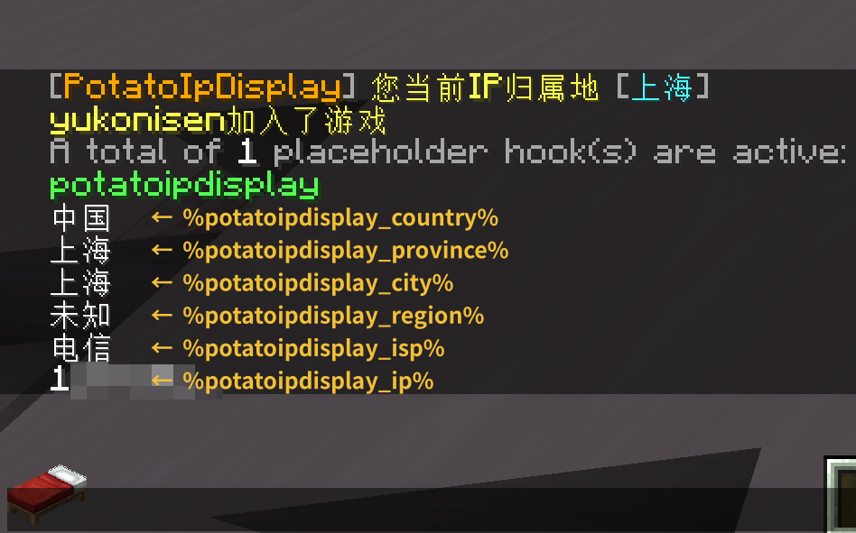

# PotatoIpDisplay

一款用于显示玩家Ip归属地的Minecraft插件，支持 Bukkit 和 Velocity

## 使用文档（中文）
详见 [此处](https://upt.curiousers.org/docs/PotatoIpDisplay/intro)

## Placeholder API

| 变量                           | 描述      | 返回示例        |
|:-----------------------------|:--------|:------------|
| `%potatoipdisplay_ip%`       | 玩家的 IP  | `11.45.1.4` |
| `%potatoipdisplay_country%`  | IP 所属国家 | `中国`        |
| `%potatoipdisplay_province%` | IP 所属省份 | `上海`        |
| `%potatoipdisplay_city%`     | IP 所属城市 | `上海`        |
| `%potatoipdisplay_region%`   | IP 所属区域 | `未知`（可能无法识别 |
| `%potatoipdisplay_isp%`      | 运营商信息   | `联通`        |



## bStats
<a href="https://bstats.org/plugin/bukkit/PotatoIpDisplay/21473"></a>

## LICENSE
```
Copyright (C) 2024 by NightFish <hk198580666@outlook.com>
Copyright (C) 2024 by yukonisen <yukonisen@curiousers.org>

This program is free software: you can redistribute it and/or modify
it under the terms of the GNU General Public License as published by
the Free Software Foundation, either version 3 of the License, or
(at your option) any later version.

This program is distributed in the hope that it will be useful,
but WITHOUT ANY WARRANTY; without even the implied warranty of
MERCHANTABILITY or FITNESS FOR A PARTICULAR PURPOSE.  See the
GNU General Public License for more details.

You should have received a copy of the GNU General Public License
along with this program. If not, see <http://www.gnu.org/licenses/>.
```